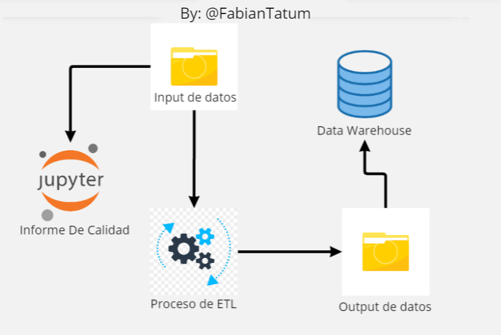

# HENRY-INDIVIDUAL-PROJECT

## **Estudiante**: Fabian Palacios Borja - bfpalaciosborja@gmail.com - @FabianTatum
### Repositorio del trabajo original - [aquí](https://github.fabiantatum)

## Contenido

- Un informe de Calidad en los datos en Jupiter NB.
- Un proceso de ETL automatizado (Batch Process).
    + Archivo de ejecución principal `main.py`
    + Archivo de Logs o historial de procesos `logs.txt`
    + Archivo de funciones de ayuda o helpers.
    + Carpeta `etl` con archivos de `extract, transform y load`

## Estructura del Projecto



## Para Ejecutar

Para ejecutar el proceso de automatización se debe tener instalado:

- Python, Pandas, Matplotlib y Seaborn (Utilizarse preferiblemente con ambiente Conda.)
- Docker y Docker Compose.
- La imagen docker de MariaDB `docker pull mariadb`
- Cliente MySQL o MariaDB.

Se ha hecho uso y pruebas en Windows WSL y Linux.

## Instrucciones

- Activar Docker en caso de no tenerlo activo
```
sudo dockerd
```

- Dar permisos de ejecución al archivo ./start.sh
```
sudo chmod +x ./start.sh
```

- Ejecutar el archivo:
```
./start.sh
```

### !PARA REALIZAR NUEVAMENTE LA INGESTA DE ARCHIVOS DEBO EJECUTAR `start.sh` CON UN ARGUMENTO:
EJEMPLO:
```
./start.sh 1

## O tambien:

./start.sh batch
```
## Funcionamiento del Proceso ETL


En caso de que tenga un docker compose de la versión 2 la línea `docker compose up -d` deberá modificarse por `docker-compose up -d`.

**`EN CASO DE QUERER REINICIAR EL PROCESO COMPLETO SE PUEDE EJECUTAR:`**

- SOLO EN CASO DE HABER REALIZADO DOS VECES EL PROCESO DE ETL, DEVUELVE LOS DOCUMENTOS A SU ESTADO ORIGINAL
```
./restart.sh
```

PARA MIS QUERIDOS INSTRUCTORES:
+ Posibles fallas: 
    + la ingesta de datos a la base de datos funciona en Linux Ubuntu, pero no en los contenedores WSL, intento copiar los archivos dentro del contenedor, pero cuando aplico `LOAD DATA INFILE` aparece el siguiente error:
    ```
    ERROR 13 (HY000) at line 3: Can't get stat of '/var/lib/mysql/data-output/Clientes.csv' (Errcode: 2 "No such file or directory")
    ```
    lo mismo sucede con `LOAD LOCAL DATA INFILE` por lo cual planeo realizar la ingesta con PostgresQL.
