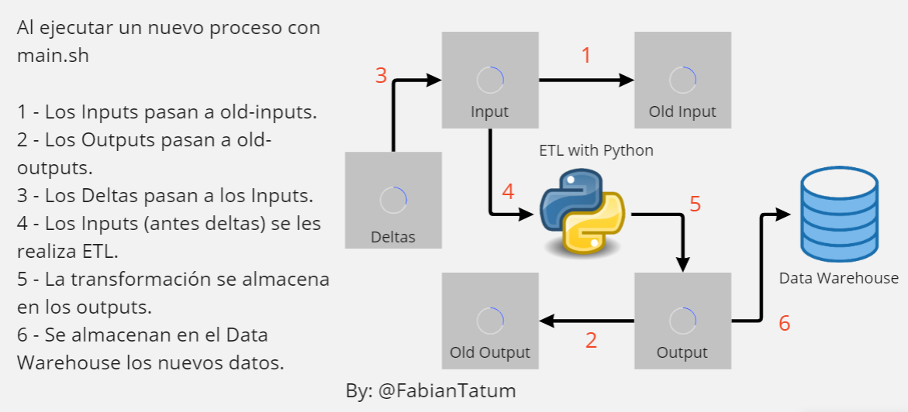
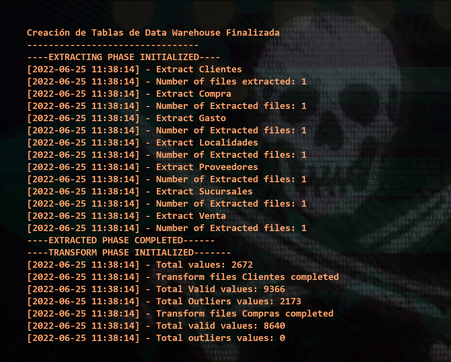

# ETL E-Commerce Data Quality

Este proyecto es un informe de la calidad de datos de diferentes fuentes de un E-Commerce de Argentina, en donde evaluamos los valores existentes, cuales pueden presentar fallas, cuales estan incompletos, cuales estan nulos y ofrecemos algunas recomendaciones para modificar estos datos antes de subirlos a un data warehouse.

Luego de evaluar esta calidad, procedemos a realizar un proceso de ETL automatizado, en donde limpiamos los datos, los transformamos y los cargamos a un data warehouse el cual se encuentra en un contenedor de Docker.

Este proceso se realiza automaticamente al ejecutar el script `./start.sh` y en ellos combinamos diferentes tecnologias para ciencia de datos, como Python para el proceso de ETL, Bash para la automatización, Docker para el almacenado de datos, Pandas para la visualización y evaluación de los datos y SQL para construir nuestro data warehouse.


## Contenido

- Un informe de Calidad en los datos en Jupiter NB.
- Un proceso de ETL automatizado (Batch Process).
    + Archivo de ejecución principal `main.py`
    + Archivo de Logs o historial de procesos `logs.txt`
    + Archivo de funciones de ayuda o helpers.
    + Carpeta `etl` con archivos de `extract, transform y load`

## Estructura del Projecto


## Para Ejecutar

Para ejecutar el proceso de automatización se debe tener instalado:

- Python, Pandas, Matplotlib y Seaborn (Utilizarse preferiblemente con ambiente Conda.)
- Docker y Docker Compose.
- La imagen docker de MariaDB `docker pull mariadb`
- Cliente MySQL o MariaDB.

Se ha hecho uso y pruebas en Windows WSL y Linux.

## Instrucciones

- Activar Docker en caso de no tenerlo activo
```
sudo dockerd
```

- Dar permisos de ejecución al archivo ./start.sh
```
sudo chmod +x ./start.sh
```

- Ejecutar el archivo:
```
./start.sh
```

- Para realizar nuevamente el proceso de ETL con los deltas o actualizaciones debes ejecutar `start.sh` con un argumento:
EJEMPLO:
```
./start.sh 1

## O tambien:

./start.sh batch
```
## Funcionamiento del Proceso ETL


Si deseas visualizar el data warehouse en un cliente MySQL como Workbench o XAMPP, el puerto de entrada es 3333 y la clave 1234.

- En caso de que tenga un docker compose de la versión 2 la línea `docker compose up -d` deberá modificarse por `docker-compose up -d`.

- Puedes visuazar toda la actividad del proceso en tu consola:



**`EN CASO DE QUERER REINICIAR EL PROCESO COMPLETO SE PUEDE EJECUTAR:`**

- SOLO EN CASO DE HABER REALIZADO DOS VECES EL PROCESO DE ETL, DEVUELVE LOS DOCUMENTOS A SU ESTADO ORIGINAL
```
./restart.sh
```
